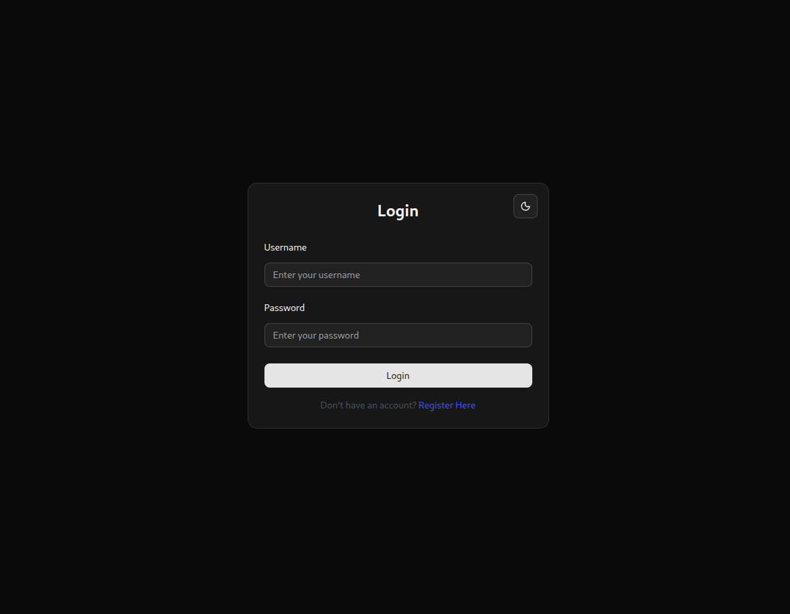
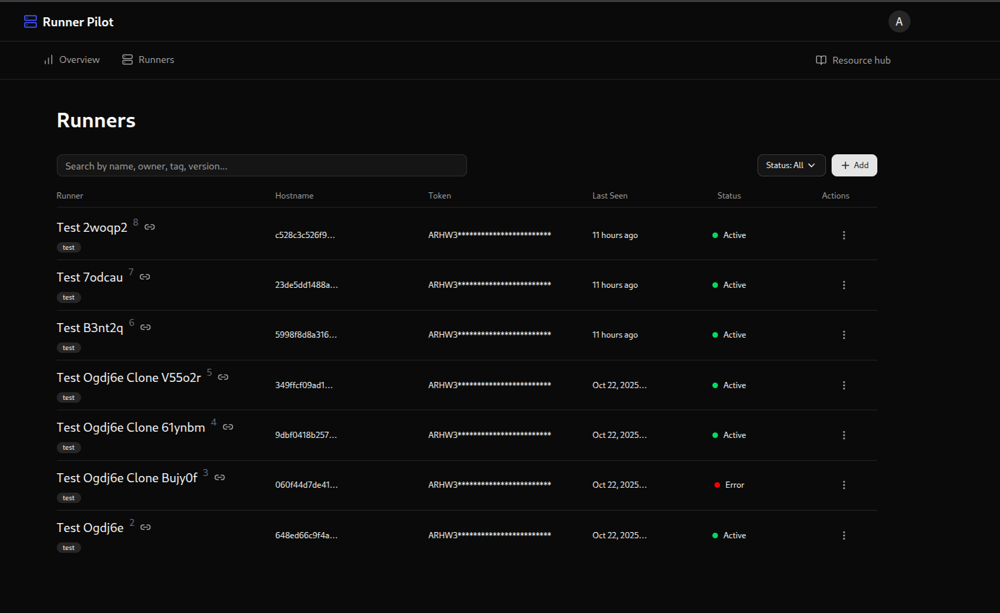
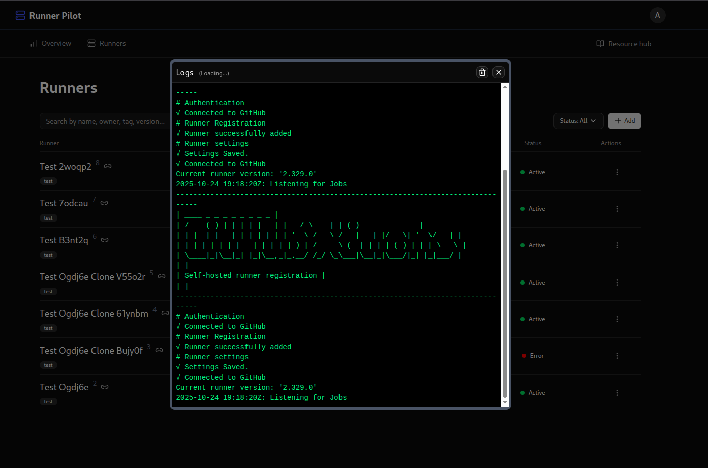
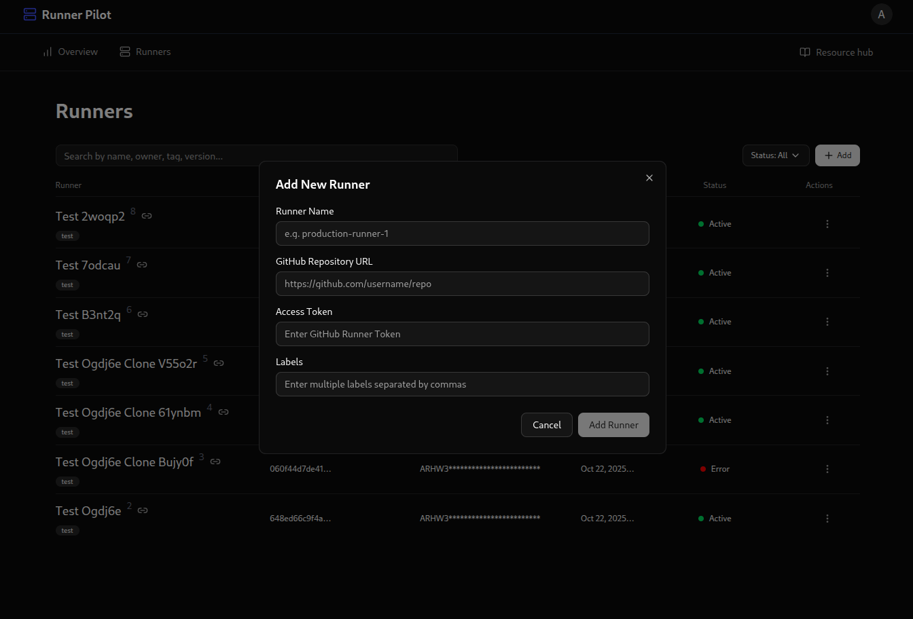

# RunnerPilot - GitHub Action Runners On The Fly

A comprehensive web-based platform to manage GitHub Action self-hosted runners effortlessly. Create, manage, and monitor runners across your repositories with built-in RBAC support and workspace management.

## 📸 Screenshots

| | |
|---|---|
|  |  |
|  |  |

---

## 🚀 Quick Start

### Prerequisites

- **Python**: 3.13+
- **Node.js**: 18+
- **npm** or **yarn**
- **Git**
- **Docker** 

### Installation & Setup

#### Step 1: Clone the Repository
```bash
git clone https://github.com/0xAungkon/RunnerPilot.git
cd RunnerPilot
```

#### Step 2: Configure Environment Variables
```bash
cp frontend/.env.example frontend/.env
cp backend/.env.example backend/.env
```

Edit the `.env` files in both `frontend/` and `backend/` directories with your configuration.

---

## 🔧 Running the Application

### Backend Setup

The backend uses **FastAPI** with **Peewee ORM** and **uv** for package management.

```bash
cd backend
```

#### Create Virtual Environment
```bash
uv venv
```

#### Install Dependencies
```bash
uv sync
```

#### Run Development Server
```bash
make run
```

The backend will start on `http://localhost:8000`

**Backend Stack:**
- FastAPI 0.119.0+
- Peewee ORM
- Pydantic
- Docker SDK
- JWT Authentication

---

### Frontend Setup

The frontend is built with **React**, **TypeScript**, **Vite**, and **Tailwind CSS**.

```bash
cd frontend
```

#### Install Dependencies
```bash
npm install
# or
npm i
```

#### Run Development Server
```bash
npm run dev
```

#### Access the Application
Open your browser and navigate to:
```
http://localhost:5172/login
```

**Frontend Stack:**
- React 18+
- TypeScript
- Vite
- Tailwind CSS
- Radix UI Components
- Axios for API calls

---

## 📁 Project Structure

```
RunnerPilot/
├── backend/                          # FastAPI backend
│   ├── inc/                          # Core modules
│   │   ├── auth.py                   # Authentication logic
│   │   ├── config.py                 # Configuration
│   │   ├── db.py                     # Database setup
│   │   ├── helpers/                  # Helper functions
│   │   └── utils/                    # Utility functions
│   ├── models/                       # Data models
│   │   ├── meta.py
│   │   └── runner_instance.py
│   ├── routers/                      # API endpoints
│   │   ├── auth.py
│   │   ├── common.py
│   │   ├── meta.py
│   │   ├── runner_instance.py
│   │   └── system.py
│   ├── volumn/                       # Docker runner volumes
│   ├── main.py                       # Application entry point
│   ├── pyproject.toml               # Dependencies
│   └── Makefile
│
├── frontend/                         # React frontend
│   ├── src/
│   │   ├── components/               # React components
│   │   │   ├── layouts/              # Layout components
│   │   │   ├── providers/            # Context providers
│   │   │   └── ui/                   # UI components (Radix)
│   │   ├── pages/                    # Page components
│   │   │   ├── Authentication/
│   │   │   └── Dashboard/
│   │   ├── context/                  # React context
│   │   ├── hooks/                    # Custom hooks
│   │   ├── lib/                      # Utilities & API client
│   │   └── main.tsx
│   ├── public/                       # Static assets
│   ├── package.json
│   └── vite.config.ts
│
├── nginx/                            # Nginx configuration
├── docker-compose.yml
└── README.md
```

---

## 🐳 Docker Deployment

### Build and Run with Docker Compose

```bash
# Build all services
make build

# Start all services
make up

# View logs
make logs

# Stop services
make down

# Clean up
make clean
```

### Available Make Commands

```bash
make build          # Build all services
make up             # Start all services in background
make down           # Stop all services
make logs           # Show logs from all services
make frontend-logs  # Show frontend logs only
make backend-logs   # Show backend logs only
make clean          # Remove all containers and volumes
make rebuild        # Rebuild and start all services
make ps             # Show running containers
```

---

## 🔐 Authentication

RunnerPilot includes JWT-based authentication with RBAC (Role-Based Access Control) support.

**Login URL:** `http://localhost:5172/login`

Configure your authentication provider in the `backend/.env` file.

---

## 🎯 Core Features

### ✅ Implemented
- JWT-based authentication
- Self-hosted runner management
- Runner instance creation and deletion
- System monitoring and logs viewing
- RBAC support
- Workspace management
- Docker-based runner deployment

### 🚧 In Development / TODO

1. **Enforce Strong Redirection** - Implement protected route redirection on frontend
2. **Overview Page** - Build comprehensive overview dashboard in both frontend and backend
3. **Docker Deployment** - Complete testing and configuration for production Docker setup
4. **Multi-Node Support** - Enable multi-node runner architecture

---

## 📝 API Documentation

The backend provides REST API endpoints for:

- **Authentication** (`/routers/auth.py`) - Login, logout, token management
- **Runners** (`/routers/runner_instance.py`) - Create, list, delete runners
- **Meta** (`/routers/meta.py`) - System metadata and information
- **System** (`/routers/system.py`) - System health and status
- **Common** (`/routers/common.py`) - Common utilities

### Interactive API Docs

Visit `http://localhost:8000/docs` for Swagger UI documentation.

---

## 🛠️ Development

### Backend Development

```bash
cd backend

# Create virtual environment
uv venv

# Install dependencies
uv sync

# Run development server
make run

# Run tests (if configured)
pytest
```

### Frontend Development

```bash
cd frontend

# Install dependencies
npm install

# Start dev server
npm run dev

# Build for production
npm run build

# Preview production build
npm run preview

# Lint code
npm run lint
```

---

## 🐛 Troubleshooting

### Port Already in Use

- **Backend (8000)**: Change `uvicorn` port in `backend/Makefile`
- **Frontend (5172)**: Vite will automatically use next available port

### Database Issues

The backend uses SQLite by default. Check `test.db` in the backend directory:
```bash
cd backend
rm test.db  # Reset database (optional)
```

### Environment Variables Not Loading

Ensure `.env` files are in the correct directories:
- `frontend/.env`
- `backend/.env`

Restart the development servers after updating `.env` files.

---

## 📦 Dependencies

### Backend (Python)
- FastAPI 0.119.0+
- Peewee 3.18.2
- Pydantic 2.12.3+
- PyJWT 2.8.0+
- Docker SDK
- Uvicorn 0.37.0+

### Frontend (Node.js)
- React 18+
- TypeScript 5+
- Vite 5+
- Tailwind CSS 4+
- Radix UI
- Axios 1.12.2+
- Framer Motion

---

## 📄 License

This project is licensed under the MIT License. See the LICENSE file for details.

---

## 🤝 Contributing

Contributions are welcome! Please follow these steps:

1. Fork the repository
2. Create a feature branch (`git checkout -b feature/amazing-feature`)
3. Commit your changes (`git commit -m 'Add amazing feature'`)
4. Push to the branch (`git push origin feature/amazing-feature`)
5. Open a Pull Request

---

## 📧 Support & Contact

For issues, questions, or suggestions, please open an issue on GitHub or contact the maintainers.

**Repository:** [0xAungkon/RunnerPilot](https://github.com/0xAungkon/RunnerPilot)

---

## 🎓 Roadmap

- [ ] Enforce strong redirection over protected routes on frontend
- [ ] Implement comprehensive overview page in frontend and backend
- [ ] Complete Docker deployment testing and configuration
- [ ] Add multi-node runner support
- [ ] User management dashboard
- [ ] Runner health monitoring
- [ ] Webhook integration for GitHub
- [ ] Enhanced logging and audit trails
